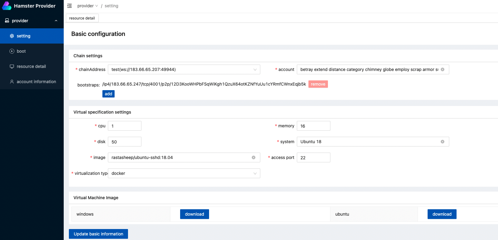
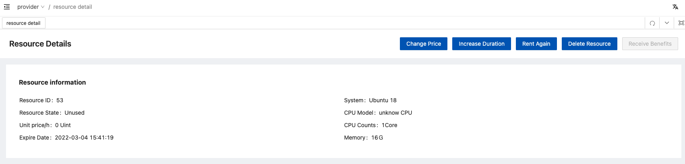
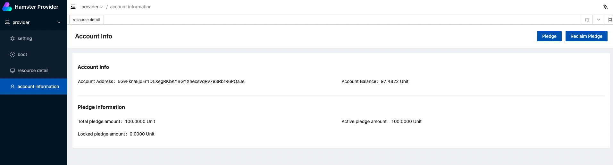
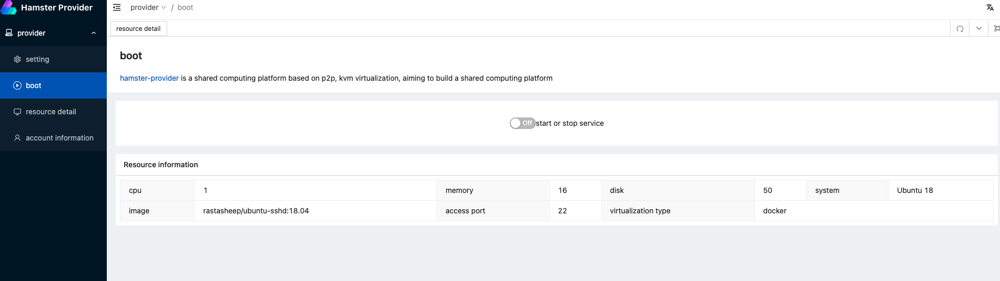
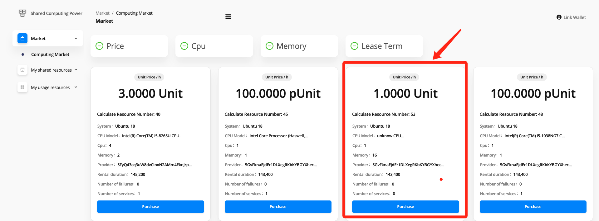
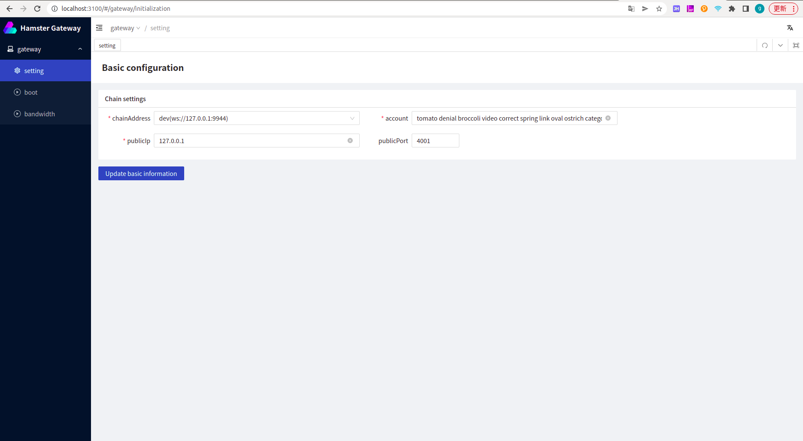
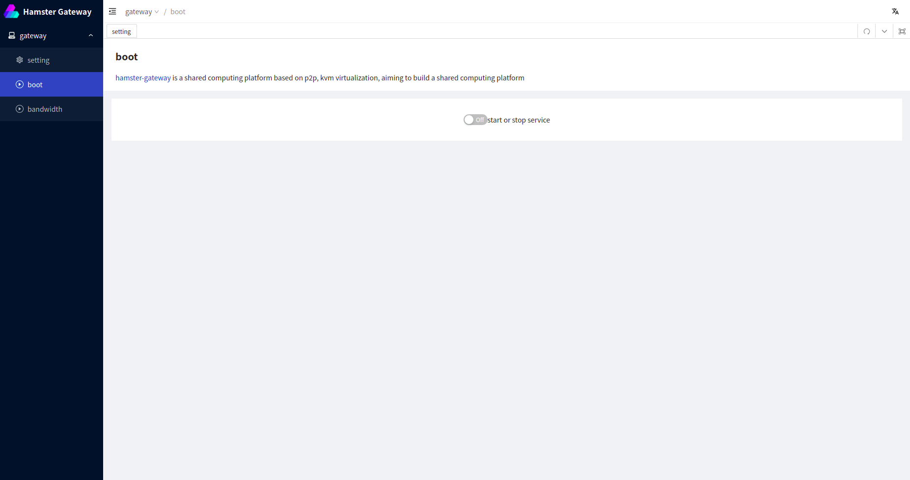
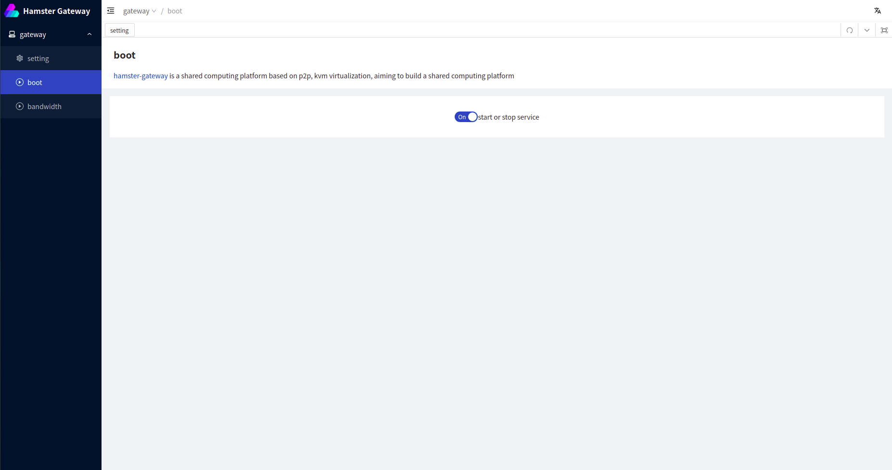
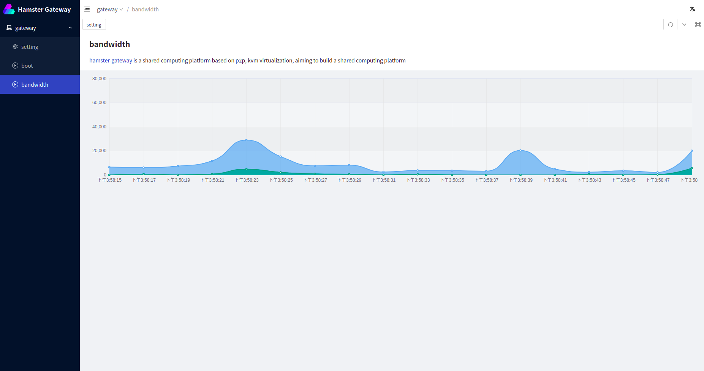

# Hamster 

## Introduction to hamster
Hamster is a decentralized computing network based on the underlying chain. It aims to provide users with cost-effective computing servers. It is a decentralized platform for leasing computing resources that can be performed to rent idle computing resources.

Hamster aims to build a complete platform for leasing idle computing resources. The decentralized computing resource leasing function is realized by using substrate framework pallet, which can be leased and traded on the chain, and the link and use of computing resources can be done through the p2p network protocol under the chain after signing the lease agreement on the chain.

## Hamster details

Hamster is composed of Hamster nodes, Hamster resource providers, Hamster clients, Hamster gateways, and Hamster front-end pages.

- Hamster Node: is a custom node built on Substrate 3.0.
    - pallet_provider: performs resource provider registration and provider resource information storage, and provides a computational marketplace.
    - pallet_resource-order: performs resource lease order functions and lease agreement execution.
    - pallet_gateway: The gateway mainly has the following functions: gateway registration, gateway heartbeat detection. The main role is to add the gateway as an important player in the shared computing platform

- Hamster Gateway: p2p gateway with public IP, used to link information between resource provider and resource user, built with libp2p component, is the cornerstone of the leased resource availability, can register itself to Hamster Node. That includes the Register and Configuration modules.
    - Register: Register Gateway information to Hamster Node.
    - Configuration: Basic configuration of p2p gateway information.

- Hamster Provider: can provide compute resources and register them with Hamster Node. Compute resources are provided using both vm virtual machine technology and docker technology. Currently vm virtual machine technology is used to better protect user privacy. That includes the Initialize configuration, Resource details, Account information and Configuration information modules.
    - Initialize configuration: Initialize configuration, including p2p seed node configuration, p2p port configuration.
    - Resource details: Available spare resource specifications (cpu, memory, etc.), and price.
    - Account information: Provide the import of the substrate account, provide the pledge of the deposit before the service, etc.
    - Configuration information: resources that have not reached a transaction are offline at any time, resource specifications, price configuration, etc.

- Hamster Client: After purchasing compute resources in the front-end marketplace, users can view them through the client and link to them. That includes the Market, My order and My resource modules.
    - Market: A trading market where computing power providers submit idle computing power to the market and configure prices. The client can choose the configuration and price resources to be purchased to form a transaction contract.
    - My Orders: List and details of all resource orders I have purchased.
    - My resources: The list of resources corresponding to the current valid order, the client app can establish a connection with the remote resources through the list of resources.
    - Link: Connect your purchased resources.

- Hamster Front End: Hamster Dapp, which allows users to purchase compute resources that have already been provided, and pay a certain Token to purchase a certain amount of time to use the compute resources. We can pay by the hour for more flexible use(Your browser needs to install [Polkadot JS](https://polkadot.js.org/extension/) plug-in,).

## Preparation

- Need to install rust environment
- Install node(node version > v16.0.0)
- Installing the wails environment(wails 2)
- Installation go environment(golang version >= v1.17)

## Start the hammer chain locally

You need to install the trust environment locally.

### 1.download

```bash
git clone https://github.com/hamster-shared/hamster.git && cd hamster
```

### 2 Build

The `cargo run` command will perform an initial build. Use the following command to build the node
without launching it:

```sh
cargo build --release
```
### 3 Run

```bash
./target/release/node-template --dev --ws-external --rpc-external --rpc-cors all --unsafe-rpc-external --rpc-methods unsafe --unsafe-ws-external --no-mdns
```
### 4 Local browser browsing
After you start successfully, you can visit the [apps wallet (hosted)](https://polkadot.js.org/apps/) to access the chain node you started.


## Start the hammer provider locally

### Premise

```
- node version > v16.0.0
- golang version >= v1.17
- IDE recommendation: Goland
```

###1.Run

```bash
# install package dependency

## ubuntu
sudo apt install qemu-kvm libvirt-daemon-system libvirt-clients bridge-utils virtinst virt-manager libvirt-devel
sudo systemctl is-active libvirtd

## centos
yum install -y qemu-kvm libvirt virt-install libvirt-dev
systemctl start libvirtd && systemctl enable libvirtd


# clone the project
git clone https://github.com/hamster-shared/hamster-provider.git

# open frontend directory
cd frontend

# install frontend dependency
npm install

# build frontend 
npm run serve

# go to root directory
cd ..

# use go mod And install the go dependency package
go mod tidy

# Compile 
go build

# Run init config
./hamster-provider init (windows The run command is hamster-provider.exe)

# Run Daemon 
./hamster-provider daemon (windows The run command is hamster-provider.exe)
```
### 2.How to use

#### Basic configuration information

When you have finished launching the provider, visit the following URL in your browser to log into the provider administration backend

```
localhost:3100
```



You can set your account information and resource sharing configuration in the setting screen, such as the chain address of your connection, your account information, and the way you provide computing resources (docker or kvm) and basic information such as cpu, memory, ports, etc.


#### Resource Details Configuration

Once the basic setup is complete, you can jump to the resource details page, where you can see information about the resources you want to rent



- Here you can

  - Modify the unit price of the rental \h
  - Increase the number of hours to be rented out
  - Rent out the resource again if it has expired
  - Delete the resource to be rented out if it is in a normal state
  - Take away your earnings


#### Pledge

Note: Before renting the machine, you must pledge a certain amount, otherwise the order will fail to be executed, the pledge must meet the order amount of 1:1, you can play as pledge in "account information"




#### Rental Resources

When the above operation is completed and confirmed, come to the boot screen and click start, then you can view your rental resources in the calculation market.





## Start the hamster client locally

### Run
Download the appropriate version of the client for your system through our [distribution](https://github.com/hamster-shared/hamster-client/releases), or download the source code from [github](https://github.com/hamster-shared/hamster-client) to compile and run.

### How to use
#### 1 import account

The first time you enter into the client, you need to import your account, as shown in the figure


#### 2 Setting

In the settings, you can configure your own public key information, configure the chain node you want to connect to (default is ws://127.0.0.1:9944), you can modify it to the corresponding ip+port number, and you can also set the gateway you want to connect to


#### 3 Resource Market

You can view and buy all the resources now available in the 'Resource Market', and enter your public key and duration of your purchase.


#### 4 Order List

After the purchase is completed, you can check your order information in 'Order List', and the order status are: Completed, Cancelled, and Processing.

- Completed: The provider has processed the order and is ready to provide the machine for you to connect.
- Processing: The provider is preparing the machine for your purchase.
- Cancelled: If the processing is not completed for a long time, you can cancel this order and purchase again


#### 5 My Resource

Once the order has been processed, you can find all the resources you purchased here


#### 6 Link

You can connect your purchased resources here, click connect, then initialize the configuration, enter the port you want to map to the local machine, click link, then you can check the status to see if the connection is successful.

Then click copy and execute the command on the command line to connect successfully.


#### 7 Status


You can copy the ssh command to the command line and run it to access the purchased container

## Start the hamster gateway locally

### Premise
```
- node version > v16.0.0
- golang version >= v1.17
- IDE recommendation: Goland
```

### Run 
```bash

# clone the project
git clone https://github.com/hamster-shared/hamster-gateway.git

# open frontend directory
cd frontend

# install frontend dependency
npm install

# build frontend 
npm run build

# run frontend
npm run serve

# go to root directory
cd ..

# use go mod And install the go dependency package
go mod tidy

# Compile 
go build


# Run Daemon 
./hamster-gateway daemon (windows The run command is hamster-gateway.exe)
```
### How to use

####1.Configuration information

When you have finished launching the provider, visit the following URL in your browser to log into the provider administration backend

```
localhost:3100
```



You can set your account information and resource sharing configuration on the settings interface, such as the link address of your connection, your account information, your public IP, and the node port.

####2.Register gateway node

When the above operation is completed and confirmed, come to the boot screen and click start，then your gateway node will then be registered on-chain





####3. Node bandwidth display

After you start and register the gateway node to the chain, you can view the bandwidth data of your gateway node.



## Start hamster web locally
### Run

#### Install Docker

docker is the easiest way to build, we recommend using docker for building Hamster nodes

Points to note before run in docker：

- You need to install [docker](https://www.docker.com/) by yourself before starting, refer to docker official website for details

* You can modify the value of BASE_URL by yourself to connect to different underlying chains

```bash
docker run -d -e BASE_URL=ws://127.0.0.1:9944 -p 80:80 hamstershare/hamstershare-frontend:latest
```
### How to use

####1.Link Wallet

First make sure you have the browser wallet plugin [Polkadot{.js} extension](https://polkadot.js.org/extension/) installed.

Then visit the web, choose Link wallet. If you have imported your account in advance in your browser plugin, you will be able to see your account information on dapp

 ```
 http://localhost:80
 ```


####2 Order Management

Then you can buy resources in dapp or manage your own resource prices, rental times, pledges for your own account, and also view your orders and agreements


After purchasing the resource, you can check the status of your order in the "order list", if the provider did not execute successfully, you can choose to cancel order to cancel this order


View the resources you are using in the service list after the order has been completed


## The above is what we have accomplished in the two milestones