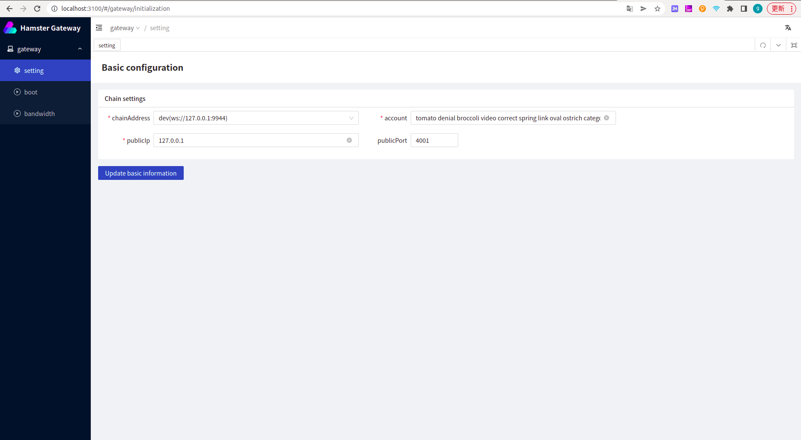
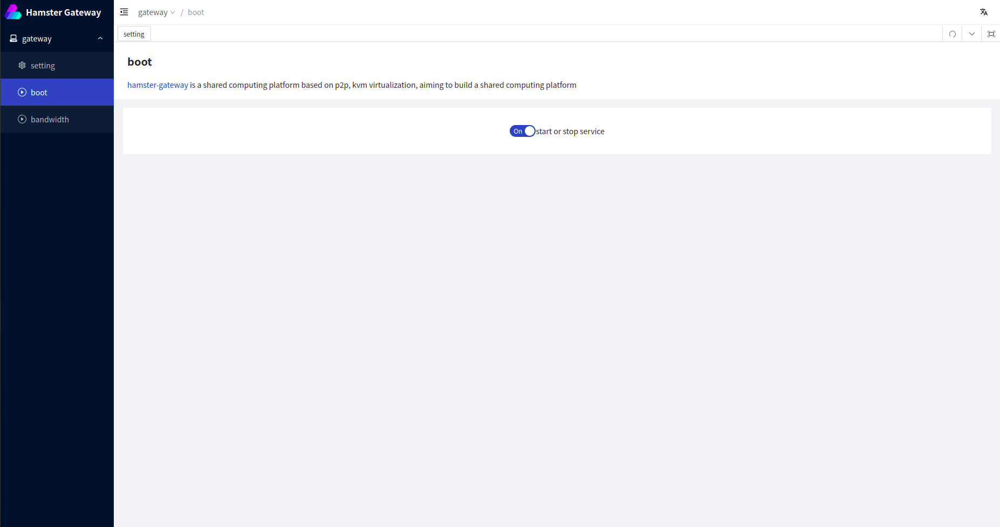
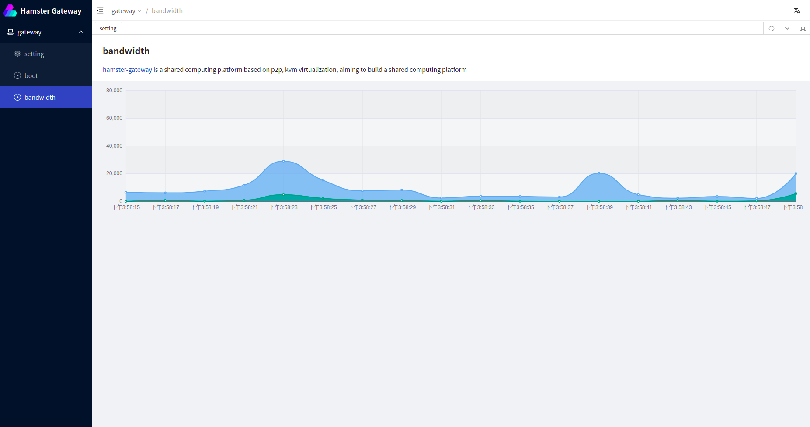

# Hamster Gateway

# 1. Overview

> Hamster-Gateway is a bootstrap node based on [go-libp2p](https://github.com/libp2p/go-libp2p.git) , which provides a public network-based node discovery service.


# 2. Run

## 2.1 Getting started

```
- node version > v16.0.0
- golang version >= v1.17
- IDE recommendation: Goland
```

### 2.1 server project

```bash

# install package dependency


# clone the project
git clone https://github.com/hamster-shared/hamster-gateway.git

# open frontend directory
cd frontend

# install frontend dependency
npm install

# build frontend 
npm run build

# go to root directory
cd ..

# use go mod And install the go dependency package
go mod tidy

# Compile 
go build


# Run Daemon 
./hamster-gateway daemon (windows The run command is hamster-gateway.exe)

```

# 3.How to use

## Configuration information

When you have finished launching the provider, visit the following URL in your browser to log into the provider administration backend

```
localhost:3100
```



You can set your account information and resource sharing configuration on the settings interface, such as the link address of your connection, your account information, your public IP, and the node port.

## Register gateway node

When the above operation is completed and confirmed, come to the boot screen and click start，then your gateway node will then be registered on-chain




## Node bandwidth display

After you start and register the gateway node to the chain, you can view the bandwidth data of your gateway node.

