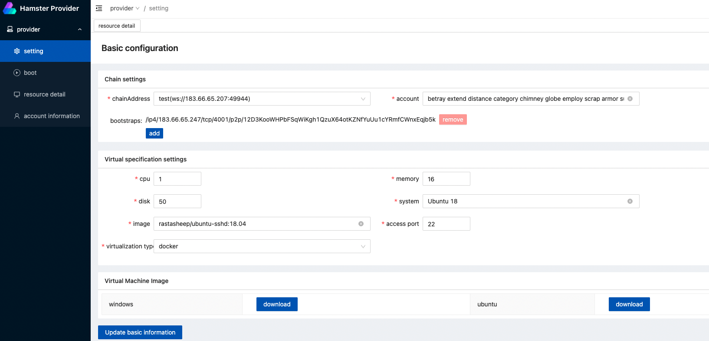
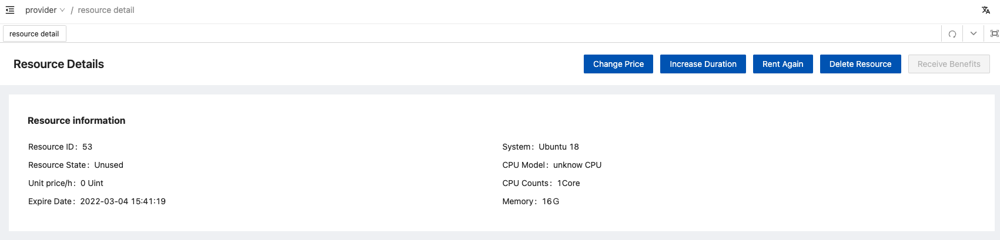
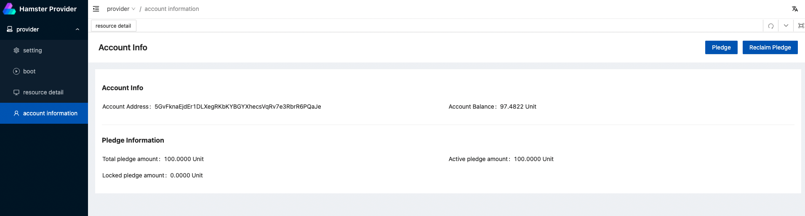
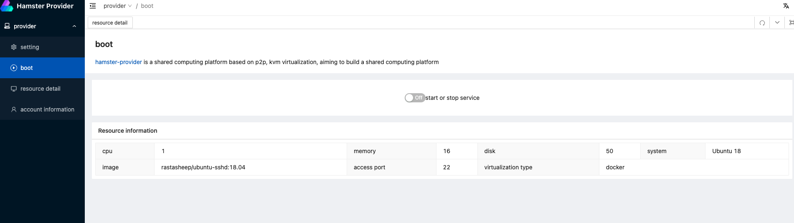

# Hamster Provider

# 1. Overview

> Hamster-Provider is a blockchain compute node based on [go-libp2p](https://github.com/libp2p/go-libp2p.git) and [libvirt-go](https://github.com/libvirt/libvirt-go), which provide trusted infrastructure services. It can provide users' idle resources to the Hamster Market in the form of virtual machines.

# 2. Run

## 2.1 Getting started

```
- node version > v16.0.0
- golang version >= v1.17
- IDE recommendation: Goland
```

### 2.1 server project

```bash
# install package dependency

## ubuntu
sudo apt install qemu-kvm libvirt-daemon-system libvirt-clients bridge-utils virtinst virt-manager libvirt-devel
sudo systemctl is-active libvirtd

## centos
yum install -y qemu-kvm libvirt virt-install libvirt-dev
systemctl start libvirtd && systemctl enable libvirtd


# clone the project
git clone https://github.com/hamster-shared/hamster-provider.git

# open frontend directory
cd frontend

# install frontend dependency
npm install

# build frontend 
npm run serve

# go to root directory
cd ..

# use go mod And install the go dependency package
go mod tidy

# Compile 
go build

# Run init config
./hamster-provider init (windows The run command is hamster-provider.exe)

# Run Daemon 
./hamster-provider daemon (windows The run command is hamster-provider.exe)
```


# 3.How to use

## Basic configuration information

When you have finished launching the provider, visit the following URL in your browser to log into the provider administration backend

```
localhost:3100
```



You can set your account information and resource sharing configuration in the setting screen, such as the chain address of your connection, your account information, and the way you provide computing resources (docker or kvm) and basic information such as cpu, memory, ports, etc.


## Resource Details Configuration

Once the basic setup is complete, you can jump to the resource details page, where you can see information about the resources you want to rent



- Here you can

  - Modify the unit price of the rental \h
  - Increase the number of hours to be rented out
  - Rent out the resource again if it has expired
  - Delete the resource to be rented out if it is in a normal state
  - Take away your earnings


## Pledge

Note: Before renting the machine, you must pledge a certain amount, otherwise the order will fail to be executed, the pledge must meet the order amount of 1:1, you can play as pledge in "account information"




## Rental Resources

When the above operation is completed and confirmed, come to the boot screen and click start, then you can view your rental resources in the calculation market.




